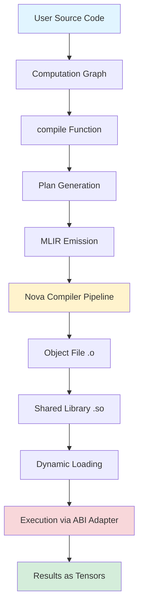
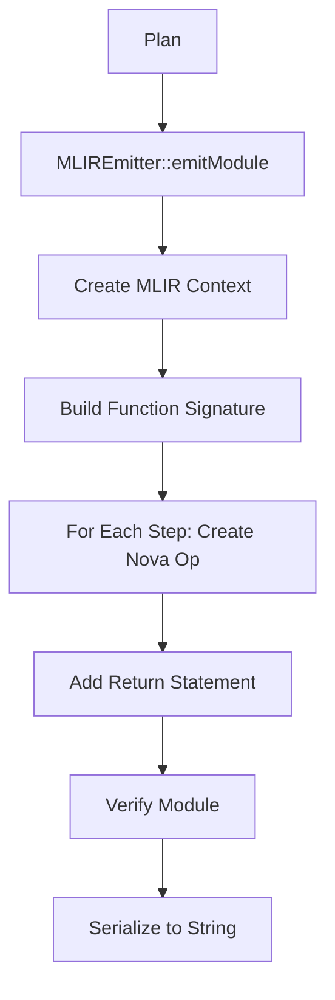
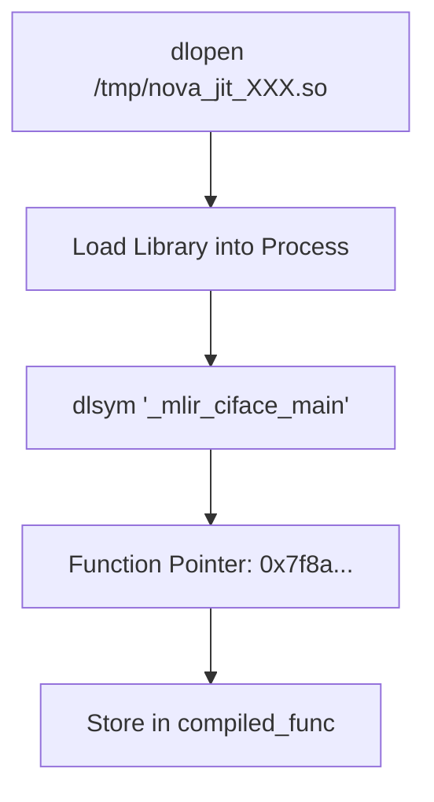
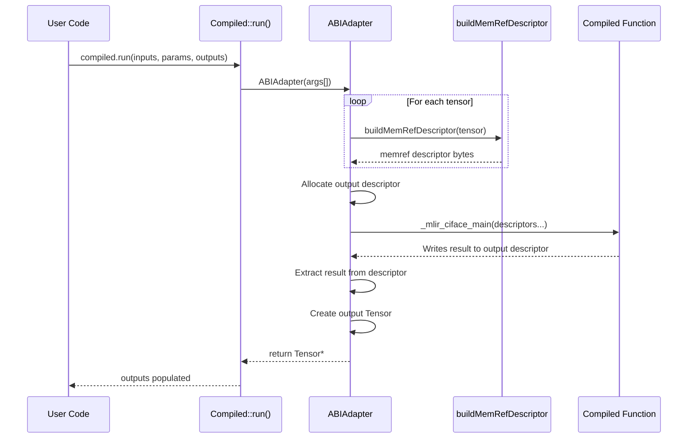
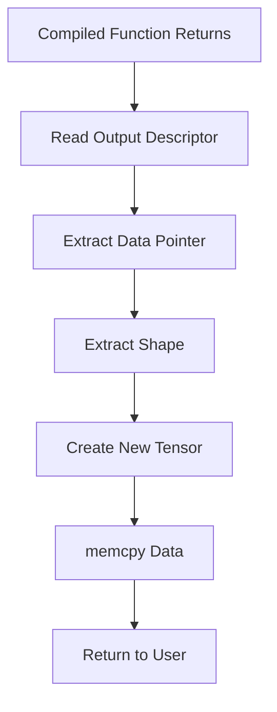
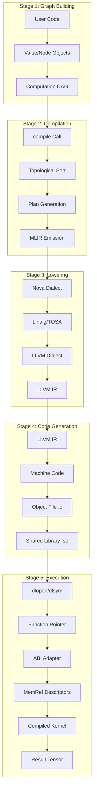

# Complete JIT Compilation & Execution Flow Map

This document maps the entire journey from source code to compiled execution in the cgadimpl JIT compiler.

---

## High-Level Overview



---

## Phase 1: Graph Construction (User Code)

### What Happens
User writes autograd code that builds a computation graph.

### Code Example
```cpp
// test_graph_compile.cpp lines 18-36
auto X = make_tensor(Tensor::randn<float>(Shape{{B, In}}), "X");
auto W1 = make_tensor(Tensor::randn<float>(Shape{{In, Out}}), "W1");
auto b1 = make_tensor(Tensor::zeros(Shape{{1, Out}}), "b1");

Value Z = matmul(X, W1) + b1;      // Creates graph nodes
Value loss = mse_loss(Z, target);   // More nodes added
ag::backward(loss);                 // Builds backward graph
```

### Internal State
Each operation creates a `Node` object:
- **Node structure**: `{op, inputs[], value, shape, requires_grad}`
- Nodes are linked: `loss → mse_loss → add → matmul → leaves`
- This creates a **DAG (Directed Acyclic Graph)**

### Key Files
- [ag_all.hpp](file:///home/blubridge-038/Music/cgadimpl/cgadimpl/include/ad/ag_all.hpp) - API entry points
- [graph.hpp](file:///home/blubridge-038/Music/cgadimpl/cgadimpl/include/ad/core/graph.hpp) - Node definitions
- [nodeops.hpp](file:///home/blubridge-038/Music/cgadimpl/cgadimpl/include/ad/ops/nodeops.hpp) - Operations

---

## Phase 2: Compilation Request

### What Happens
User calls `ag::jit::compile()` to freeze the graph into an executable plan.

### Code Example
```cpp
// test_graph_compile.cpp lines 48-55
std::vector<Value> inputs = {X, target};
std::vector<Value> params = {W1, b1};

ag::jit::CompileOptions opts;
opts.include_backward = true;
auto compiled = ag::jit::compile(loss, inputs, params, opts);
```

### Key File
[jit_compiler.cpp:351-742](file:///home/blubridge-038/Music/cgadimpl/cgadimpl/src/runtime/jit_compiler.cpp#L351-L742)

---

## Phase 3: Plan Generation

### What Happens
The `compile()` function traverses the graph and creates a `Plan` - a linear sequence of operations.

### Process Flow


### Data Structure: Plan
```cpp
struct Plan {
    Signature sig;           // Metadata about inputs/params
    std::vector<Step> steps; // Ordered operations
    std::vector<int> out_slots; // Which slots to return
    int num_slots;           // Total temporary storage
};

struct Step {
    Op op;                   // Operation type (Add, MatMul, etc.)
    std::vector<Arg> args;   // Input arguments  
    TensorMetadata out_meta; // Output shape/dtype/device
    int out_slot;            // Where to store result
};
```

### Example Plan Output
```
Step 0: Slot 0 = MatMul(Input[0], Param[0])
Step 1: Slot 1 = Add(Slot[0], Param[1])
Step 2: Slot 2 = MSELoss(Slot[1], Input[1])
Step 3: Slot 3 = Leaf(Tensor[1.0])  // gradient seed
Step 4: Slot 4 = [backward ops...]
```

### Key Code
[jit_compiler.cpp:359-409](file:///home/blubridge-038/Music/cgadimpl/cgadimpl/src/runtime/jit_compiler.cpp#L359-L409) - Forward plan
[jit_compiler.cpp:410-672](file:///home/blubridge-038/Music/cgadimpl/cgadimpl/src/runtime/jit_compiler.cpp#L410-L672) - Backward plan

---

## Phase 4: MLIR Emission

### What Happens
The `Plan` is converted to MLIR (Multi-Level Intermediate Representation) using the Nova dialect.

### Process Flow



### MLIR Output Example
```mlir
module {
  func.func @main(
    %arg0: tensor<8x16xf32>,     // Input X
    %arg1: tensor<16x10xf32>,    // Param W1
    %arg2: tensor<1x10xf32>,     // Param b1
    %arg3: tensor<8x10xf32>      // Target
  ) -> tensor<f32> {
    %0 = nova.matmul %arg0, %arg1 : (tensor<8x16xf32>, tensor<16x10xf32>) -> tensor<8x10xf32>
    %1 = nova.add %0, %arg2 : (tensor<8x10xf32>, tensor<1x10xf32>) -> tensor<8x10xf32>
    %2 = nova.mse %1, %arg3 : (tensor<8x10xf32>, tensor<8x10xf32>) -> tensor<f32>
    return %2 : tensor<f32>
  }
}
```

### Key Operations Mapping
| Plan Op | MLIR Op | Line |
|---------|---------|------|
| Add | `nova.add` | [mlir_emitter.cpp:219-225](file:///home/blubridge-038/Music/cgadimpl/cgadimpl/src/core/mlir_emitter.cpp#L219-L225) |
| MatMul | `nova.matmul` | [mlir_emitter.cpp:243-249](file:///home/blubridge-038/Music/cgadimpl/cgadimpl/src/core/mlir_emitter.cpp#L243-L249) |
| MSELoss | `nova.mse` | [mlir_emitter.cpp:370-377](file:///home/blubridge-038/Music/cgadimpl/cgadimpl/src/core/mlir_emitter.cpp#L370-L377) |
| GELU | `nova.gelu` | [mlir_emitter.cpp:292-298](file:///home/blubridge-038/Music/cgadimpl/cgadimpl/src/core/mlir_emitter.cpp#L292-L298) |

### Key File
[mlir_emitter.cpp:76-469](file:///home/blubridge-038/Music/cgadimpl/cgadimpl/src/core/mlir_emitter.cpp#L76-L469)

---

## Phase 5: Nova Compiler Pipeline

### What Happens
MLIR goes through multiple transformation passes to lower from high-level Nova ops to LLVM IR.

### Compiler Pipeline


### Transformation Examples

**Before (Nova):**
```mlir
%2 = nova.matmul %0, %1 : (tensor<8x16xf32>, tensor<16x10xf32>) -> tensor<8x10xf32>
```

**After Linalg:**
```mlir
%2 = linalg.matmul ins(%0, %1 : tensor<8x16xf32>, tensor<16x10xf32>)
                   outs(%init : tensor<8x10xf32>) -> tensor<8x10xf32>
```

**After Bufferization:**
```mlir
linalg.matmul ins(%0, %1 : memref<8x16xf32>, memref<16x10xf32>)
              outs(%dest : memref<8x10xf32>)
```

**After LLVM Lowering:**
```llvm
call @gemm_kernel(ptr %A, ptr %B, ptr %C, i64 8, i64 16, i64 10)
```

### Key Code
The compilation is invoked at:
[jit_compiler.cpp:702-714](file:///home/blubridge-038/Music/cgadimpl/cgadimpl/src/runtime/jit_compiler.cpp#L702-L714)

```cpp
mlir::nova::NovaCompilerAPI compiler;
mlir::nova::CompilerOptions options;
options.runFullPipeline = true;
auto result = compiler.compileString(mlir_source, "", options);
```

---

## Phase 6: Object File Generation

### What Happens
The compiled MLIR is converted to native machine code in a `.o` object file.

### Process

```mermaid
graph LR
    A[MLIR Text] --> B[Write to /tmp/nova_jit_XXX.mlir]
    B --> C[nova-opt: MLIR → Object]
    C --> D[/tmp/nova_jit_XXX.o]
    
    style D fill:#fff3cd
```

### Command Executed
```bash
nova-opt \
  --pass-pipeline="builtin.module(nova-to-linalg,linalg-bufferize,...)" \
  --mlir-print-ir-after-all \
  /tmp/nova_jit_XXX.mlir \
  -o /tmp/nova_jit_XXX.o
```

### Object File Contents
- Compiled machine code for the `_mlir_ciface_main` function
- Symbol table with function entry points
- Relocation information for linking

### Key Code
[jit_compiler.cpp:1086-1096](file:///home/blubridge-038/Music/cgadimpl/cgadimpl/src/runtime/jit_compiler.cpp#L1086-L1096)

```cpp
bool success = mlir::nova::NovaCompilerSystemAPI::compileToObject(
    mlir_file, obj_file, nova_opt
);
```

---

## Phase 7: Shared Library Creation

### What Happens
The `.o` file is linked into a `.so` (shared object) library that can be dynamically loaded.

### Process


### Command Executed
```bash
gcc -shared -fPIC \
  -o /tmp/nova_jit_XXX.so \
  /tmp/nova_jit_XXX.o
```

### Why Shared Library?
- `.o` files cannot be loaded directly by `dlopen()`
- `.so` files are position-independent and dynamically loadable
- Enable runtime symbol resolution

### Key Code
[jit_compiler.cpp:1099-1105](file:///home/blubridge-038/Music/cgadimpl/cgadimpl/src/runtime/jit_compiler.cpp#L1099-L1105)

---

## Phase 8: Dynamic Loading

### What Happens
The compiled shared library is loaded into memory and the function pointer is retrieved.

### Process



### Code Flow
```cpp
// Load the .so file
void* handle = dlopen(so_file.c_str(), RTLD_LAZY | RTLD_LOCAL);

// Get function pointer to the compiled code
void* func_ptr = dlsym(handle, "_mlir_ciface_main");

// Store it for later execution
c.compiled_func = func_ptr;
storeAOTContext(func_ptr, plan, mlir_source);
```

### Key Code
[jit_compiler.cpp:1107-1130](file:///home/blubridge-038/Music/cgadimpl/cgadimpl/src/runtime/jit_compiler.cpp#L1107-L1130)

---

## Phase 9: Execution via ABI Adapter

### What Happens
When `compiled.run()` is called, the ABI adapter translates between C++ tensors and MLIR's memref format.

### Complete Execution Flow



### Memory Layout Transformation

**Input: C++ Tensor**
```
Tensor object {
  void* data_ptr = 0x12345000
  Shape{8, 16}
  Dtype::Float32
}
```

**Converted to: MemRef Descriptor**
```
Byte layout:
[0-7]:   allocated_ptr = 0x12345000
[8-15]:  aligned_ptr   = 0x12345000
[16-23]: offset        = 0
[24-31]: sizes[0]      = 8
[32-39]: sizes[1]      = 16
[40-47]: strides[0]    = 16
[48-55]: strides[1]    = 1
```

**Compiled Function Receives**
```cpp
void _mlir_ciface_main(
    void* result_desc,  // Where to write output
    void* arg0_desc,    // Input tensor descriptor
    void* arg1_desc,    // Param tensor descriptor
    ...
)
```

### Key Functions

| Function | Purpose | Lines |
|----------|---------|-------|
| `buildMemRefDescriptor` | C++ Tensor → MemRef bytes | [759-794](file:///home/blubridge-038/Music/cgadimpl/cgadimpl/src/runtime/jit_compiler.cpp#L759-L794) |
| `ABIAdapter` | Orchestrates the call | [847-1064](file:///home/blubridge-038/Music/cgadimpl/cgadimpl/src/runtime/jit_compiler.cpp#L847-L1064) |
| `Compiled::run` | Entry point | [1169-1205](file:///home/blubridge-038/Music/cgadimpl/cgadimpl/src/runtime/jit_compiler.cpp#L1169-L1205) |

---

## Phase 10: Result Extraction

### What Happens
The compiled function writes results to the output descriptor, which must be unpacked back to a C++ Tensor.

### Process



### Code Flow
```cpp
// Read descriptor (lines 1002-1010)
char* result_ptr = result_descriptor.data();
void* data_ptr = *reinterpret_cast<void**>(result_ptr);
int64_t* sizes = reinterpret_cast<int64_t*>(result_ptr + 24);

// Create output tensor (lines 1030-1035)
Tensor* out = new Tensor(
    Shape{sizes[0], sizes[1]},
    Dtype::Float32,
    DeviceIndex(Device::CPU)
);

// Copy data back (line 1045)
memcpy(out->data<float>(), data_ptr, total_elements * sizeof(float));
```

### Key Code
[jit_compiler.cpp:1001-1063](file:///home/blubridge-038/Music/cgadimpl/cgadimpl/src/runtime/jit_compiler.cpp#L1001-L1063)

---

## Complete Data Flow Timeline



---

## Summary Table

| Phase | Input | Output | Key File | Purpose |
|-------|-------|--------|----------|---------|
| 1. Graph | User ops | Node DAG | [graph.hpp](file:///home/blubridge-038/Music/cgadimpl/cgadimpl/include/ad/core/graph.hpp) | Capture computation |
| 2. Plan | Node DAG | Plan steps | [jit_compiler.cpp](file:///home/blubridge-038/Music/cgadimpl/cgadimpl/src/runtime/jit_compiler.cpp) | Linearize graph |
| 3. MLIR | Plan | Nova MLIR | [mlir_emitter.cpp](file:///home/blubridge-038/Music/cgadimpl/cgadimpl/src/core/mlir_emitter.cpp) | High-level IR |
| 4. Compile | MLIR | LLVM IR | Nova Compiler | Optimization passes |
| 5. Codegen | LLVM IR | .o file | `nova-opt` | Native code |
| 6. Link | .o file | .so library | `gcc` | Dynamic loading |
| 7. Load | .so file | Function pointer | `dlopen/dlsym` | Get executable |
| 8. Execute | Tensors | MemRefs | ABIAdapter | Format conversion |
| 9. Return | MemRef | Tensor | ABIAdapter | Extract results |

---

## Performance Benefits

### Why JIT Compilation?

1. **Fusion**: Multiple ops combined into single kernel
2. **Specialization**: Code optimized for specific shapes/dtypes
3. **Memory**: Reduced intermediate allocations
4. **Backend**: Direct LLVM optimization pipeline

### Example Optimization

**Before (Eager):**
```cpp
Tensor t1 = matmul(X, W1);      // Kernel launch 1
Tensor t2 = add(t1, b1);        // Kernel launch 2  
Tensor loss = mse_loss(t2, Y);  // Kernel launch 3
// 3 kernel launches, 2 intermediate tensors allocated
```

**After (JIT):**
```cpp
compiled.run(inputs, params, outputs);
// Single kernel launch, fused operations, no intermediates
```

---

## Debugging Tips

### Enable Verbose Output
The code already has debug prints:
- `[Compile]` - Compilation progress
- `[NovaAOT]` - Object/library generation
- `[ABIAdapter]` - Execution details

### Inspect MLIR
```cpp
std::cout << compiled.getMLIRSource() << "\n";
```

### Check Generated Files
```bash
ls -lh /tmp/nova_jit_*
# .mlir - MLIR source
# .o    - Object file
# .so   - Shared library
```

### Verify Function Symbol
```bash
nm /tmp/nova_jit_*.so | grep mlir_ciface_main
```

